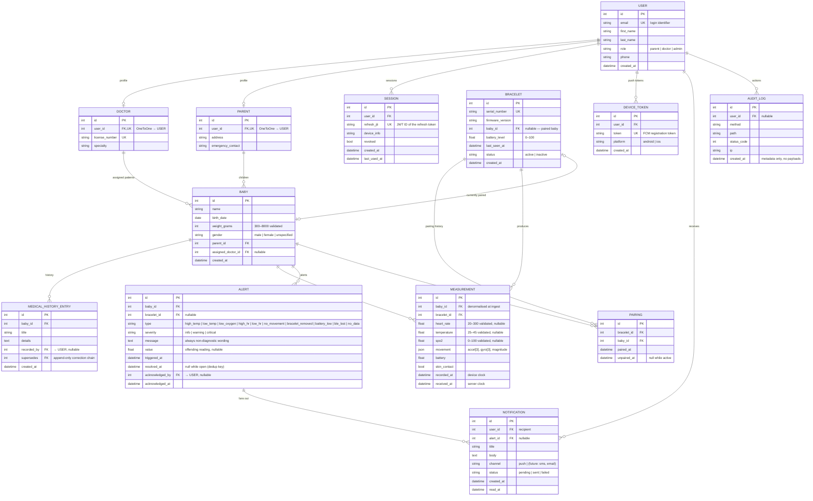

# Entity-Relationship Diagram (ERD)

Database schema of the Django backend (PostgreSQL in production, SQLite in
local tests). Rendered with Mermaid — viewable on GitHub or any Mermaid
viewer.

## Design notes

- **`MEASUREMENT.baby_id` is denormalised** at ingest time (copied from the
  bracelet's current pairing) so historical data stays attached to the baby
  even after unpairing/re-pairing the bracelet to another child.
- **Alert dedup**: one *open* alert (`resolved_at IS NULL`) per
  `(baby, type)`; rules skip firing while an open alert of the same type
  exists. Acknowledging a non-persistent alert resolves it.
- **`SESSION.refresh_jti`** enables refresh-token rotation: each refresh
  revokes the previous session row and records a new one; logout revokes.
- **`MEDICAL_HISTORY_ENTRY.supersedes`** keeps history append-only —
  corrections reference the superseded entry instead of editing it.
- Indexes: `measurement(baby, recorded_at)`, `alert(baby, resolved_at)`,
  `user(email)`, `bracelet(serial_number)` — the hot query paths.
