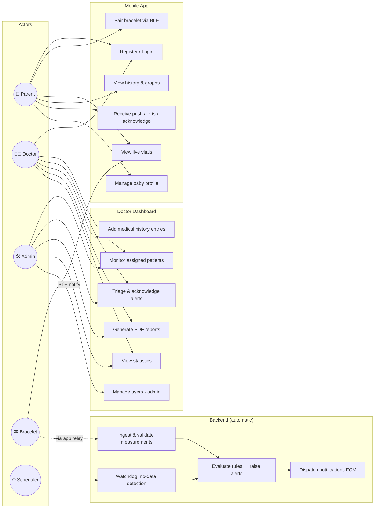
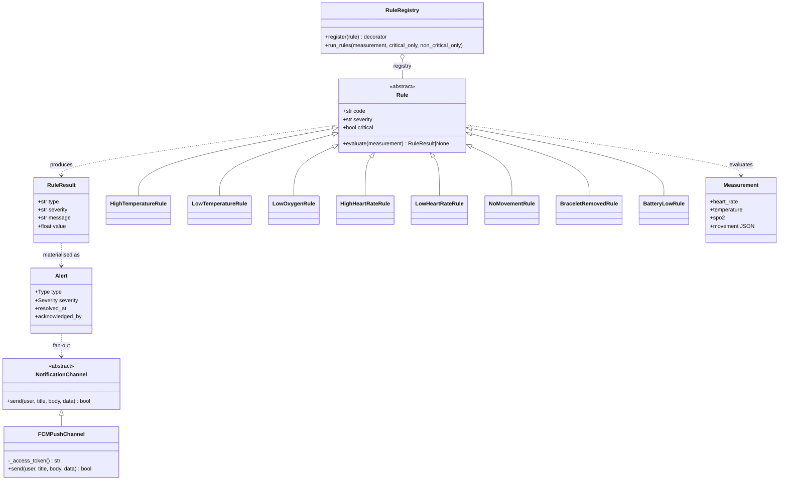
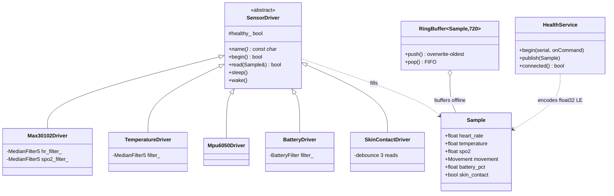
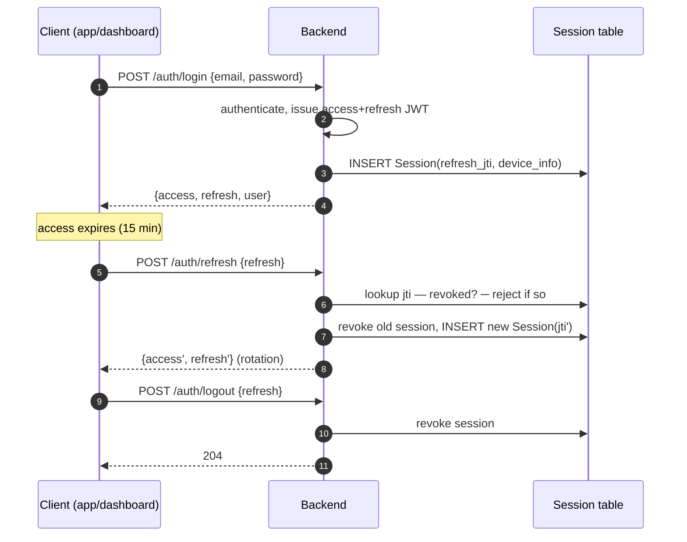

# UML Diagrams

Mermaid sources — viewable on GitHub or any Mermaid renderer.

## 1. Use-case diagram



## 2. Class diagram — backend rule engine & notifications



## 3. Class diagram — firmware sensor abstraction



## 4. Sequence — pairing, ingest, alert, notification

```mermaid
sequenceDiagram
    autonumber
    participant BR as Bracelet (ESP32)
    participant APP as Mobile app (Flutter)
    participant API as Backend (DRF)
    participant RE as Rule engine
    participant CE as Celery
    participant FCM as FCM
    participant DASH as Dashboard

    APP->>BR: BLE scan (service UUID) + connect + bond
    BR-->>APP: device_info "fw=1.0.0;serial=ABC123"
    APP->>API: POST /bracelets/ {serial, firmware}
    APP->>API: POST /bracelets/{id}/pair/ {baby_id}
    API-->>APP: 200 paired

    loop every 5 s
        BR-->>APP: notify hr/temp/spo2/movement/battery (float32 LE)
        APP->>APP: queue in SQLite (offline-first)
    end

    APP->>API: POST /measurements/ [batch ≤500]
    API->>API: validate ranges, check ownership,<br/>update last_seen_at/battery
    API->>RE: run critical rules (sync)
    RE-->>API: HIGH_TEMP fired (38.4 °C > 38.0)
    API->>API: create Alert (dedup: no open same-type)
    API->>CE: queue non-critical rules + dispatch task
    CE->>FCM: HTTP v1 send → parent & doctor device tokens
    FCM-->>APP: push "High temperature — not a diagnosis"
    APP->>APP: deep link → Alert detail screen
    DASH->>API: GET /alerts/?status=active (poll 20 s)
    API-->>DASH: alert list (+ disclaimer field)
    DASH->>API: POST /alerts/{id}/acknowledge/
    API-->>DASH: acknowledged (+auto-resolve)
```

## 5. Sequence — login & session rotation


